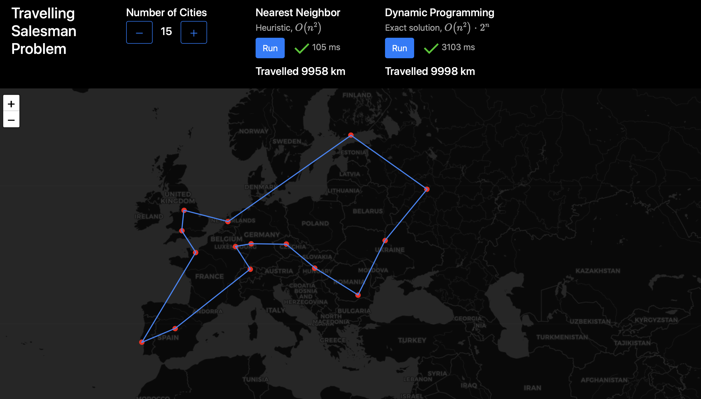

# Travelling Salesman Problem 
- [Dynamic Programming (exact solution) - JavaScript](Scripts/DynamicProgramming.js)
- [Nearest Neighbor (heuristic) - JavaScript](NearestNeighbor.js)

Comparing a recursive Dynamic Programming algorithm against a Nearest Neighbor heuristic to solve the Travelling Salesman Problem. Visualized on an interactive Leaflet map. Implemented in JavaScript.

## View website
https://exoflow.github.io/TSPAlgorithms/

